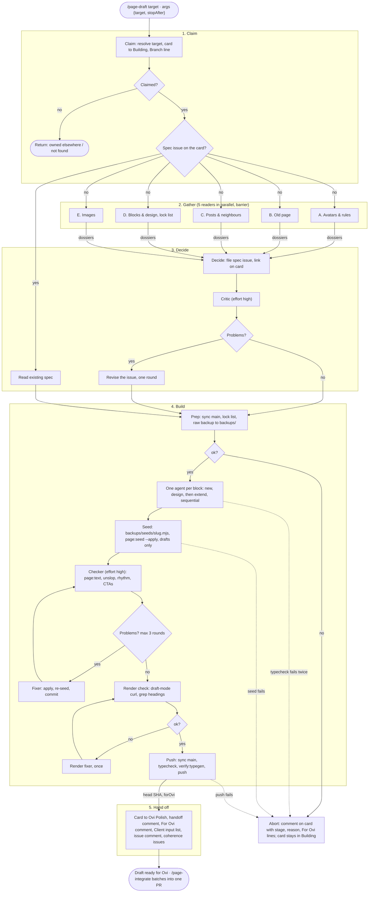

# Page draft: one page from the old site to a draft, with nobody in the loop

`/page-draft` is a dynamic workflow: `page-draft.js` beside this folder. It
takes a page of the old Canadian Adventure Camp site to a **draft**: a spec
issue, code on a pushed branch, draft content in Sanity, and the Basecamp
card in Ovi Polish. Ovi is away for the whole run. Every question the old
interactive skills asked him, the stage agent answers with the recommendation
it would have given, and records the answer and the fact it rests on.

The script holds the plan and the data between stages. Each stage is a fresh
agent that reads this folder's file for its stage, does that stage, and
returns structured data. Whatever an agent learned and did not return is gone,
so every stage fills its schema completely.

## Run it

```text
/page-draft family-guide
/page-draft https://canadianadventurecamp.com/family-guide
/page-draft https://app.basecamp.com/6230954/buckets/48063970/card_tables/cards/<id>
/page-draft 57          an existing spec issue: gather and decide are skipped
/page-draft             the top card in the To Build column
```

`args` can also be an object `{ target, stopAfter }`. `stopAfter` is `claim`,
`gather`, or `spec`; `stopAfter: "spec"` files the spec and stops, which is
what the old `spec-only` flag did.

One page per worktree. Several worktrees draft several pages at once; the
claim protocol in `docs/agents/page-workflow.md` keeps them apart. A run uses
about fifteen agents, so set the workflow size guideline to `large` or the
task panel shows a warning. A stopped run resumes from cache in the same
session: ask Claude to relaunch it.

## Stages

| Phase | Agents | Instructions | Returns to the script |
|---|---|---|---|
| Claim | 1 | `claim.md` | slug, page id, card, branch, existing issue |
| Gather | 5 in parallel | `gather.md`, one reader each | one dossier per reader |
| Decide | draft, critic, revise | `decide.md` | issue number, outline with marks |
| Build | prep, one per block, seed, review loop, render, push | `build.md`, one section each | typecheck, seed, issues, push |
| Hand off | 1 | `handoff.md` | card, lists, summary |

A failure in build comments on the card and leaves it in Building, so Ovi
sees the state on the tracker. Claim failures return without writing.

Every build stage returns `forOvi` lines (`decision:`, `review:`, `client:`,
`assumption:`). The script collects them and hand off writes them on the
card as the **For Ovi** comment, with the spec's decisions and client
questions. That comment is the list of what a human still has to settle.

## Models

The `MODEL` table at the top of the script sets model and effort per stage.
Mechanical stages (claim, gather, prep, render check, push, hand off, abort)
run on a smaller model. Copy, block design, and judgement (decide, critic,
blocks, seed, review, fixes) inherit the session model. Change the table,
not the prompts, to tune cost.

## What lives here and what does not

This folder holds only what exists for this workflow: the script and its
stage instructions. Shared references stay where they are and are cited in
place: `docs/agents/page-workflow.md` (repo facts, also used by
`page-integrate`), `docs/agents/page-builder.md`, `frontend/DESIGN.md`,
`docs/avatars.md`, `CONTEXT.md`, `frontend/PRODUCT.md`.

## Principles every stage keeps

- The old page is a starting point, never a template. Existing blocks never
  decide what a page says. Blog posts are out of scope; they migrate as-is.
- Decide, do not ask. A decision with more than one defensible answer goes in
  the spec's "Decisions made without Ovi" with the option taken and why. A
  fact the site cannot supply is a client question, never an invention.
- Repository facts live in `docs/agents/page-workflow.md`: Basecamp ids,
  the claim protocol, the shared-state rules, scripts, the render check, the
  handoff checklist. Read the part your stage needs.
- Write drafts only. Touch only this page's documents. Never publish.

## Flow


