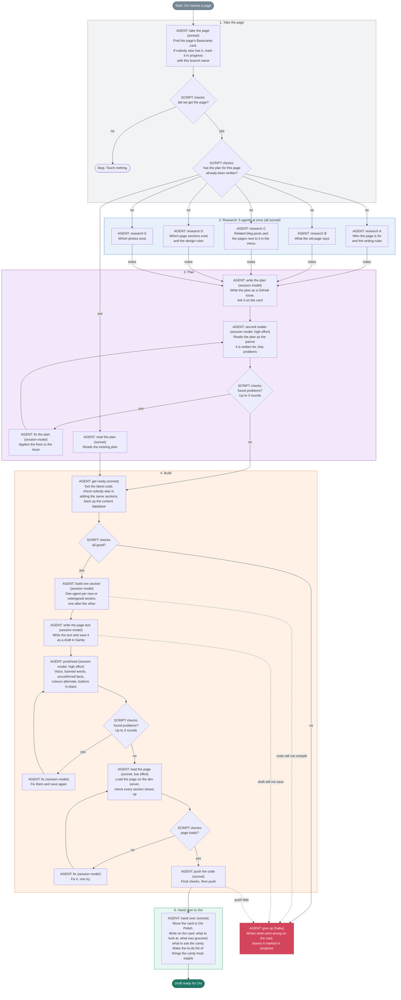

# Page draft: one page, from the old site to a draft, with nobody watching

`/page-draft` rebuilds one page of the Canadian Adventure Camp website. It
starts from the old site's page and ends with a **draft**: a written plan, the
code on a pushed branch, the page text saved as a draft in Sanity, and the
page's Basecamp card moved to "Ovi Polish". Ovi is away for the whole run.
Every question the old skills used to ask him, the agent answers with the
recommendation it would have given, and writes down the answer and the fact it
rests on.

It is a dynamic workflow: `page-draft.js` beside this folder is the script.
The script holds the order of the steps, the loops, and the data between
steps. Each step is a fresh agent that reads this folder's file for that step,
does the step, and returns its results as data. Anything an agent learned and
did not return is gone, so every agent fills in every field it is asked for.

## Run it

```text
/page-draft family-guide
/page-draft https://canadianadventurecamp.com/family-guide
/page-draft https://app.basecamp.com/6230954/buckets/48063970/card_tables/cards/<id>
/page-draft 57          the number of a plan that is already written; research and planning are skipped
/page-draft             the top card in the "To Build" column
```

`args` can also be an object `{ target, stopAfter }`. `stopAfter` can be
`take-the-page`, `research`, or `plan`. `stopAfter: "plan"` writes the plan
and stops, without building anything.

One page per worktree. Several worktrees can draft several pages at the same
time; the "taking a page" rules in `docs/agents/page-workflow.md` keep them
from colliding. A run uses about fifteen agents, so set the workflow size
guideline to `large`, or the task panel shows a warning. A stopped run picks
up where it left off in the same session: ask Claude to relaunch it.

## The five steps

| Step | Agents | Instructions | What comes back to the script |
|---|---|---|---|
| 1. Take the page | 1 | `take-the-page.md` | page name, card, branch, whether a plan already exists |
| 2. Research | 5 at once | `research.md`, one reader each | one set of notes per reader |
| 3. Plan | write, then second reader and fix, up to 3 rounds | `plan.md` | the plan's issue number and the list of sections |
| 4. Build | get ready, one per section to build, write the text, proofread loop, load the page, push | `build.md`, one heading each | whether each part worked, plus notes for Ovi |
| 5. Hand over to Ovi | 1 | `hand-over.md` | the card, the lists, a short summary |

If building fails, the agent writes what went wrong on the card and leaves the
card marked "in progress", so Ovi sees it on the tracker. If the page cannot
be taken, the run stops without writing anything.

Every build step returns "notes for Ovi": things it assumed, guessed, decided
on its own, or could not confirm. The script collects them all, and the last
step writes them on the card under the heading **For Ovi**, together with the
plan's decisions and the questions for the camp. That comment is the list of
what a human still has to settle.

## Which model runs each step

The `MODEL` table at the top of the script picks the model and effort for
each step. Simple, mechanical steps (taking the page, research, getting
ready, loading the page, pushing, handing over, giving up) run on a smaller
model. The steps that write text, design sections, or judge quality (writing
the plan, the second reader, building sections, writing the page text,
proofreading, fixing) use the session's model. Change the table, not the
prompts, to trade cost against quality.

## What lives here and what does not

This folder holds only what exists for this workflow: the script, its step
files, and the diagram. Shared documents stay where they are and are named
when needed: `docs/agents/page-workflow.md` (facts about the repo, Basecamp,
and the content database, also used by `page-integrate`),
`docs/agents/page-builder.md`, `frontend/DESIGN.md`, `docs/avatars.md`,
`CONTEXT.md`, `frontend/PRODUCT.md`.

## Words used in these files

- **Page section**: one horizontal band of a page, such as a hero or a list
  of FAQs. The code calls it a "block".
- **The plan**: the written plan for one page, stored as a GitHub issue.
- **Draft in Sanity**: page content saved but not published. Nobody sees it
  on the live site.
- **Reader**: an avatar from `docs/avatars.md`, a type of parent or camper
  the page is written for.
- **Seed file**: a small script that writes the page text into Sanity.

## Rules every step keeps

- The old page is a starting point, never a template. The sections that
  already exist never decide what a page says. Blog posts are out of scope;
  they move over as they are.
- Decide, do not ask. A choice with more than one good answer goes into the
  plan under "Decisions made without Ovi", with the option taken and why. A
  fact the site cannot supply is a question for the camp, never an invention.
- Facts about the repo live in `docs/agents/page-workflow.md`: Basecamp ids,
  how to take a page, the rules for working in parallel, the scripts, how to
  load a page without a browser, and the finish checklist. Read the part your
  step needs.
- Save drafts only. Touch only this page's documents. Never publish.

## Flow

Every box names the agent that does the work and the model it runs on.
"Session model" is whatever model the session runs; the others are set in
the `MODEL` table at the top of the script. Diamonds are checks the script
makes itself, without an agent.



Rendered copies: `flow.svg`, `flow.png`, and `flow.excalidraw` (open it at
excalidraw.com or with the VS Code Excalidraw extension). Regenerate after
editing the Mermaid:

```bash
node .claude/workflows/page-draft/render-flow.mjs    # svg + png
node .claude/workflows/page-draft/to-excalidraw.mjs  # .excalidraw
```

Both use Playwright's Chromium and fetch Mermaid and Excalidraw from CDNs.
