# Page draft: one page, from the old site to a draft, with nobody watching

`/page-draft` rebuilds one page of the Canadian Adventure Camp website. It
starts from the old site's page and ends with a **draft**: a written plan, the
code on a pushed branch, the page text saved as a draft in Sanity, and the
page's Basecamp card moved to "Ovi Polish". Ovi is away for the whole run.
Every question the old skills used to ask him, the agent answers with the
recommendation it would have given, and writes down the answer and the fact it
rests on.

It is a skill with a workflow inside it. The main agent, the one Ovi types
`/page-draft` to, is the **overseer**: it follows
`.claude/skills/page-draft/SKILL.md`, takes the page, writes the plan,
checks each stage's result against reality, and hands over. It keeps the
page facts, the research notes, and the plan in its own memory for the
whole run. The two parts with real structure, five readers at once and the
build loop, run as the `page-draft-stage` workflow
(`page-draft-stage.js` beside this folder), one call per stage. Inside a
stage each step is a fresh agent that reads this folder's file for that
step, does the step, and returns its results as data. Anything a step agent
learned and did not return is gone, so every agent fills in every field it
is asked for; the overseer is the memory between stages.

Before 2026-09-06 the whole run was one script and nobody judged anything
between steps: a step could return a filled-in answer that was wrong, and
the next step built on it. The split puts the judgement where memory is.

## Run it

```text
/page-draft family-guide
/page-draft https://canadianadventurecamp.com/family-guide
/page-draft https://app.basecamp.com/6230954/buckets/48063970/card_tables/cards/<id>
/page-draft 57          the number of a plan that is already written; research and planning are skipped
/page-draft             the top card in the "To Build" column
```

To stop early, say so in the same message: `/page-draft family-guide, stop
after the plan`. The overseer is an agent, so plain words work.

One run per worktree, never in the main checkout. Several worktrees can
draft several pages at the same time; the "taking a page" rules in
`docs/agents/page-workflow.md` keep them from colliding. Two runs started in
the same checkout join the same page and fight over it; the first step now
refuses the main checkout and treats every claim comment it did not write as
someone else's. A run uses about fifteen agents across its two stages. A
stopped stage picks up where it left off in the same session: the overseer
reruns it and the finished steps are cached.

## What a run costs

On 2026-09-05 one run took about 100 minutes, 25 agents, 650 tool calls,
and 5% of a week's Fable allowance. The cost is the number of tool calls
times the size of the context each call re-reads. Every agent started
about 37k tokens deep before it read a file, measured like this:

| Piece | Tokens |
|---|---|
| Claude Code's own prompt, both `CLAUDE.md` files, the memory index | 5k |
| The definitions of all thirty built-in tools | 25k |
| The skill list, inside the Skill tool's definition | 2k to 4k |
| The names of the deferred MCP tools | 2k |
| This workflow's preamble and step prompt | 1.5k |

The tool definitions are two thirds of it, and they are stapled to every
message. So every step now runs as the `shell-and-files` agent type
(`.claude/agents/shell-and-files.md`), which has five tools: Bash, Read,
Edit, Write, Skill. Measured on 2026-09-06, such an agent starts at about
8.5k tokens instead of 37k. Nothing in this workflow needs the other tools:
GitHub is `gh`, Basecamp is `basecamp`, Sanity is `pnpm sanity:query` and the scripts.

Turning MCP servers off does not help, and can hurt: with servers connected
Claude Code loads tool definitions on demand, without them it loads all
thirty in full. The other two levers are in the step files: exact commands
so agents do not explore, and short review rounds (one read and one fix,
a second only when the first read found more than eight problems).

## The five steps

| Step | Who | Instructions | What the overseer checks after it |
|---|---|---|---|
| 1. Take the page | the overseer | `take-the-page.md` | its claim comment is first on the card; card in Building with the branch line |
| 2. Research | workflow stage: 5 agents at once | `research.md`, one reader each | five sets of notes, none empty |
| 3. Plan | the overseer writes and fixes; one sub-agent reads; a second round only after a long first list | `plan.md` | the issue has its labels; the card's Spec issue line names it |
| 4. Build | workflow stage: get ready, one per section to build, write the text, proofread and fix (same rule), load the page, push | `build.md`, one heading each | the push landed; `pnpm page:text` shows every planned section; the page loaded |
| 5. Hand over to Ovi | the overseer | `hand-over.md` | the finish checklist |

If a stage fails, it returns the step, the reason, and the notes for Ovi so
far. The overseer fixes a small, plain cause and reruns the stage (finished
steps are cached), or writes what went wrong on the card and leaves it in
Building, so Ovi sees it on the tracker. If the page cannot be taken, the
run stops without writing anything.

Every build step returns "notes for Ovi": things it assumed, guessed, decided
on its own, or could not confirm. The stage collects them all, and the
overseer writes them on the card under the heading **For Ovi**, together
with the plan's decisions and the questions for the camp. That comment is
the list of what a human still has to settle.

## Which model runs each step

The overseer is the session's model at the session's effort: it writes the
plan and judges every stage. The `MODEL` table at the top of the stage
script picks the model and effort for each step inside a stage. Simple,
mechanical steps (research, getting ready, loading the page, pushing) run
on a smaller model. The steps that write text, design sections, or judge
quality (building sections, writing the page text, proofreading, fixing)
use the session's model; the proofreader at medium effort, as is the
second reader the overseer spawns. Change the table, not the prompts, to
trade cost against quality. Every step runs as the `shell-and-files` agent
type; see "What a run costs".

## What lives here and what does not

This folder holds only what exists for this workflow: the stage script,
its step files, and the diagram; the overseer's instructions are the skill
in `.claude/skills/page-draft/`. Shared documents stay where they are and are named
when needed: `docs/agents/page-workflow.md` (facts about the repo, Basecamp,
and the content database, also used by `page-integrate`),
`docs/agents/page-builder.md`, `frontend/DESIGN.md`, `docs/avatars.md`,
`CONTEXT.md`, `frontend/PRODUCT.md`.

## Words used in these files

- **Page section**: one horizontal band of a page, such as a hero or a list
  of FAQs. The code calls it a "block".
- **The plan**: the written plan for one page, stored as a GitHub issue.
- **Draft in Sanity**: page content saved but not published. Nobody sees it
  on the live site.
- **Reader**: an avatar from `docs/avatars.md`, a type of parent or camper
  the page is written for.
- **Seed file**: a small script that writes the page text into Sanity.

## Rules every step keeps

- The old page is a starting point, never a template. The sections that
  already exist never decide what a page says. Blog posts are out of scope;
  they move over as they are.
- Decide, do not ask. A choice with more than one good answer goes into the
  plan under "Decisions made without Ovi", with the option taken and why. A
  fact the site cannot supply is a question for the camp, never an invention.
- Facts about the repo live in `docs/agents/page-workflow.md`: Basecamp ids
  and commands, how to take a page, the rules for working in parallel, the
  scripts, how to load a page without a browser, and the finish checklist.
  Read the part your step needs.
- What the overseer hands a stage, and a stage hands a step, is true.
  Research notes go to the plan writer, the page writer, and the
  proofreader; none of them reads the sources again. Run no `--help`; the
  commands are in the step files.
- What a stage returns is data, not the truth. The overseer checks it
  against the card, the issue, the branch, and the draft before going on.
- Save drafts only. Touch only this page's documents. Never publish.

## Flow

Every box names who does the work and the model it runs on. OVERSEER boxes
are the main agent, one memory for the whole run, on the session model.
AGENT boxes are step agents inside a stage; "session model" is whatever
model the session runs, the others are set in the `MODEL` table at the top
of the stage script. Diamonds are checks: the overseer's, made from its
memory and a command or two, or the stage script's, made without an agent.

Every AGENT box is a new agent. It starts with an empty memory. It does not
know what any earlier agent read, thought, or wrote, unless that agent
returned it as data and the script put it in the new agent's instructions.
A box that runs more than once (one per section, or one per round) is a new
agent each time. What they share is on disk: the code on this branch, the
plan on GitHub, the draft in Sanity, the card on Basecamp. The overseer
remembers all of it.

```mermaid
flowchart TD
  note["OVERSEER boxes are the main agent: one memory for the whole run.
Every AGENT box is a new agent with an empty memory.
It knows only what the stage script hands it
and what is on disk, on GitHub, in Sanity, on Basecamp."]
  note ~~~ start
  start(["Start: Ovi types /page-draft"]) --> claim
  subgraph P1["1. Take the page"]
    claim["OVERSEER: take the page
Find the page's Basecamp card.
If nobody else has it, mark it in progress
with this branch name"] --> claimed{OVERSEER checks:
my claim comment is first,
card in Building?}
    claimed -- no --> stop(["Stop. Touch nothing."])
    claimed -- yes --> hasplan{OVERSEER checks:
has the plan for this page
already been written?}
  end
  subgraph P2["2. Research: workflow stage, 5 agents at once (all sonnet)"]
    gA["AGENT: research A
Who the page is for
and the writing rules"]
    gB["AGENT: research B
What the old page says"]
    gC["AGENT: research C
Related blog posts and
the pages next to it in the menu"]
    gD["AGENT: research D
Which page sections exist
and the design rules"]
    gE["AGENT: research E
Which photos exist"]
  end
  hasplan -- no --> gA & gB & gC & gD & gE
  gA & gB & gC & gD & gE -- notes --> notesq{OVERSEER checks:
five sets of notes,
none empty?}
  notesq -- no --> P2
  subgraph P3["3. Plan"]
    decide["OVERSEER: write the plan
From the notes in memory.
Save it as a GitHub issue,
link it on the card"] --> critic["AGENT: second reader (session model, medium effort)
Reads the plan as the parent
it is written for, lists problems.
A new agent each round"] --> critq{OVERSEER checks:
found problems?}
    critq -- yes --> revise["OVERSEER: fix the plan
Applies the fixes to the issue"] --> critq2{OVERSEER checks:
more than 8 problems,
and only one round so far?}
    critq2 -- yes --> critic
    readplan["OVERSEER: read the plan
Reads the existing plan into memory"]
  end
  notesq -- yes --> decide
  hasplan -- yes --> readplan
  subgraph P4["4. Build: workflow stage"]
    prep["AGENT: get ready (sonnet)
Get the latest code,
check nobody else is editing the same sections,
back up the content database"] --> prepq{SCRIPT checks:
latest code pulled,
backup made and checked?}
    prepq -- yes --> blocks["AGENT: build one section (session model)
A new agent for each new or redesigned section,
one after the other. None of them sees
what the one before it did, only its files"]
    blocks --> seed["AGENT: write the page text (session model)
Gets the research notes and the plan.
Write the text and save it
as a draft in Sanity"]
    seed --> checker["AGENT: proofread (session model, medium effort)
Gets the notes on who the page is for.
Unconfirmed facts, broken sentences, banned words,
colours alternate, buttons in place.
A new agent each round"] --> revq{SCRIPT checks:
found problems?}
    revq -- yes --> fixer["AGENT: fix (session model)
Fix them and save again.
A new agent each round"] --> revq2{SCRIPT checks:
more than 8 problems,
and only one round so far?}
    revq2 -- yes --> checker
    revq -- no --> render["AGENT: load the page (sonnet, low effort)
Load the page on the dev server,
check the draft's headings show up.
One try, no fixer"] --> renderq{SCRIPT checks:
page loads?}
    renderq -- no, written for Ovi --> push
    renderq -- yes --> push["AGENT: push the code (sonnet)
Final checks, then push"]
  end
  critq -- no --> prep
  critq2 -- no --> prep
  revq2 -- no --> render
  readplan --> prep
  prepq -- no --> failed
  blocks -. code will not compile .-> failed
  seed -. draft will not save .-> failed
  push -. push fails .-> failed
  failed["Stage returns: failed,
which step, why, notes for Ovi so far"] --> failq{OVERSEER checks:
small, plain cause?}
  failq -- yes, fix it, rerun the stage --> prep
  failq -- no --> abort["OVERSEER: give up
Writes what went wrong on the card,
leaves it in Building"]
  push --> builtq{OVERSEER checks:
push landed, draft has
every planned section, page loaded?}
  subgraph P5["5. Hand over to Ovi"]
    handoff["OVERSEER: hand over
Move the card to Ovi Polish.
Write on the card: what to look at, what was guessed,
what to ask the camp.
Make the to-do list of things the camp must supply"]
  end
  builtq -- yes, or written for Ovi --> handoff --> done(["Draft ready for Ovi"])
  style P1 fill:#f1f3f5,stroke:#868e96
  style P2 fill:#e7f0fb,stroke:#2c88d9
  style P3 fill:#f3e8fb,stroke:#9c36b5
  style P4 fill:#fff1e6,stroke:#e8833a
  style P5 fill:#e6f7f2,stroke:#207868
  style abort fill:#d3455b,stroke:#a02a3c,color:#fff
  style failed fill:#fde8ec,stroke:#a02a3c
  style start fill:#788896,stroke:#4b5c6b,color:#fff
  style done fill:#207868,stroke:#14513f,color:#fff
  style note fill:#fffbe6,stroke:#b8a200
```



Rendered copies: `flow.svg` and `flow.png` come from the Mermaid above
(`node .claude/workflows/page-draft/render-flow.mjs`, Playwright's Chromium
plus Mermaid from a CDN).

Editable copies: `flow.excalidraw` (open at excalidraw.com or with the VS
Code Excalidraw extension) and `flow.drawio` (open at app.diagrams.net or
with the VS Code draw.io extension). Both were first built from the same
list of boxes and connections in `flow-data.mjs`; every arrow is bound to
its two boxes, so moving a box moves its arrows.

**`flow.drawio` is Ovi's hand-edited copy. Do not regenerate it and do not
edit it with a script.** `build-drawio.mjs` refuses to overwrite an existing
file. When the flow changes, change `flow-data.mjs` and the Mermaid above,
rebuild the Excalidraw and the rendered copies, and tell Ovi what changed so
he can update the draw.io file himself.

```bash
node .claude/workflows/page-draft/build-excalidraw.mjs
node .claude/workflows/page-draft/render-flow.mjs
```
